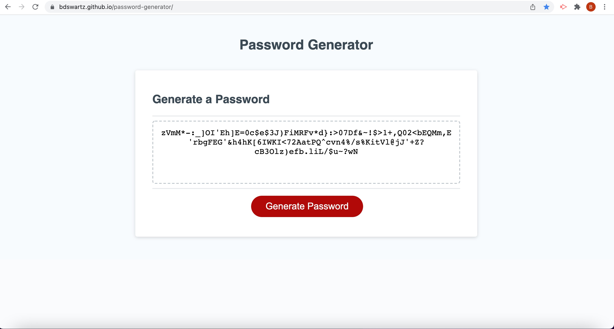

# password-generator

## Purpose
A website that, based on user input, can randomly generate a password of 8 to 128 characters using character types (special, lower case, uppercase, and numeric) chosen by the website user.

## Built With
* HTML
* CSS
* JavaScript

## Website
https://bdswartz.github.io/password-generator/

## Contribution

## Screen Shots

The following is of the HTML UI with an example password generated and entered into the textarea on the web page.

